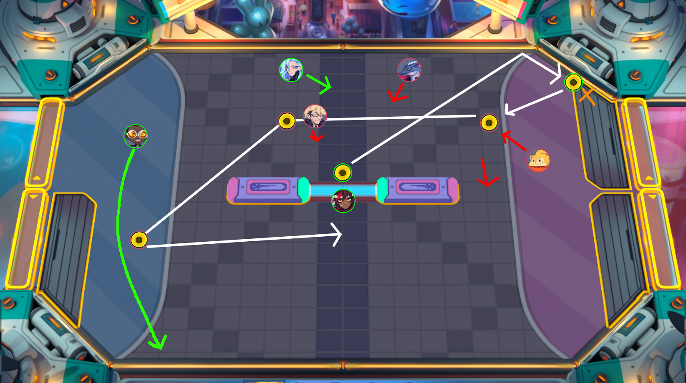

# Dubu.pro
Dubu.pro is a visual coaching and analytics tool for the game Omega Strikers, using jQuery as a drawing tool.

Dubu.pro allows to you position characters, barriers, and abilities to mimic the state of a CoreStrike game, with drawing tools to help display all of the possibilities of the game. 

Example:

